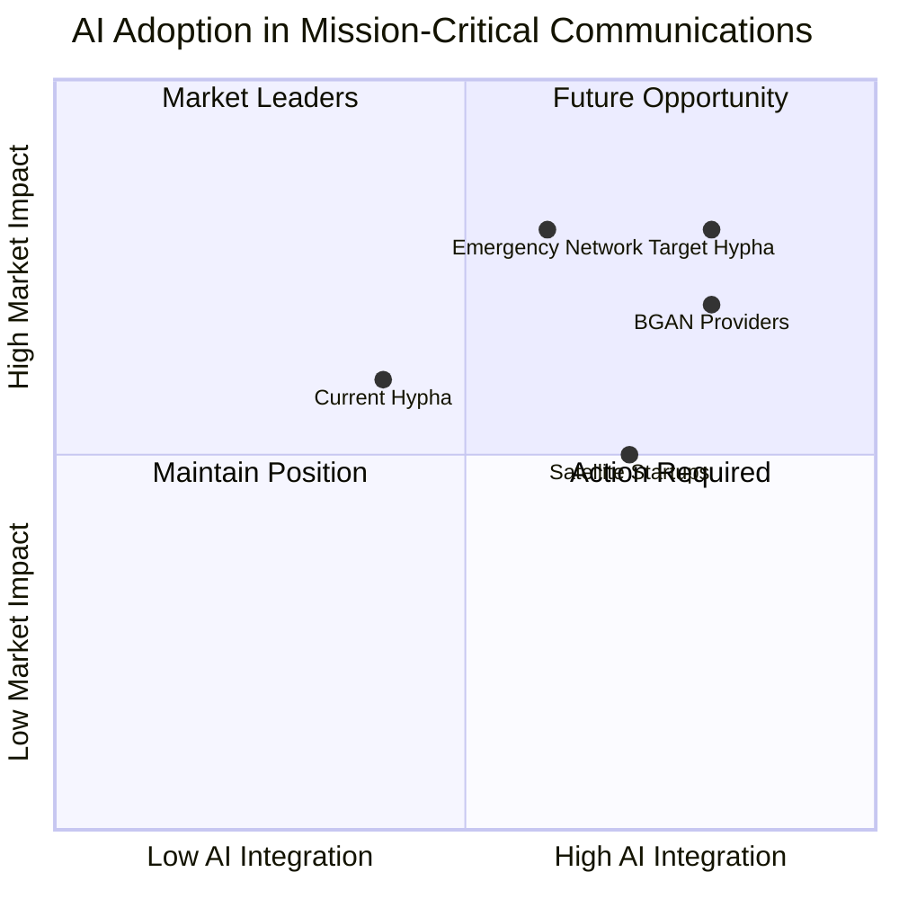

## Key Competitors and Technologies:

1. **BGAN Providers**: AI enhances monitoring & predictive network maintenance.
2. **Emergency Network Providers**: ML improves resource dispatch optimisation.
3. **Satellite Start-ups**: AI bridges ground and satellite operations during crises.

**Example:** Telstra reduced downtime by **25%** using predictive systems.

## Implications for Hypha:

- **Differentiate offerings**, such as greater automation or compliance.
- Collaborate with AI tech partners for enhancing scalability.
- Innovate to stay ahead in mission-critical industries.

Strategically embracing AI both aligns with evolving regulations and allows Hypha to maintain a competitive edge. Next steps involve collaboration discussions and proactive system onboarding.

