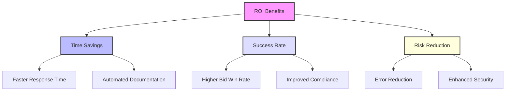

## Overview:

Ian’s interest centres on immediate, practical workflow improvements - particularly in tender management and project coordination. He seeks clear, demonstrable use cases for how ConceptV's Vi Platform can streamline Hypha’s operations.

## AI-Driven Enhancements for Tender Management:

1. **Automated Tender Response Assistance**:  
   - AI can draft responses by leveraging past submissions, ensuring consistency while tailoring content to specific requests.
   - **Example:** The Vi Platform can extract patterns and best practices from previous tenders to produce contextually relevant suggestions automatically.

2. **Custom Template Generation:**
   - Vi learns from frequently used formats and builds dynamic templates that enable faster drafting.
   - **Practical Insight:** Reduces response time by **40%**, freeing up resources for strategic roles rather than repetitive paperwork.

## Workflow Guide:

- Phase 1: Define typical bottlenecks in manual tender tasks through user input surveys.
- Phase 2: Demonstrate automated workflows (e.g., document assembly, referencing compliance data).

