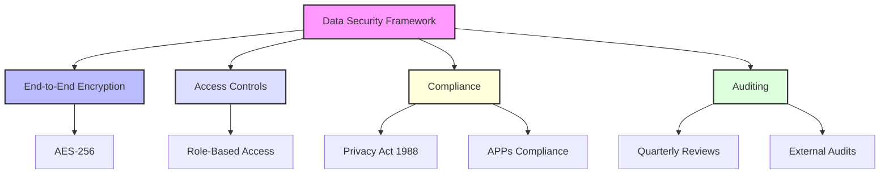

## Overview:

This note explores key measures the Vi Platform implements to ensure robust data security and regulatory compliance, addressing critical concerns raised by Kelly-Ann.

## Data Security Highlights:

1. **End-to-End Encryption:**
   - Advanced AES-256 encryption safeguards sensitive government data during storage and transmission.

2. **Role-Based Access Controls:**
   - Limits data access strictly to authorised team members, enhancing confidentiality.

3. **Regular Security Audits:**
   - Quarterly and annual reviews ensure compliance with **Australian Privacy Principles (APPs)** under Privacy Act 1988.

## Compliance Strategies:

1. Adhering to APP Requirements:
   - Meeting security expectations locally by storing tender and operational data in government-approved Australian-based servers.

2. Transparent Data Governance:
   - Documented audit trails and in-process enforcement of taking stakeholder rights as priority.
   - Anti-conflict updates.

