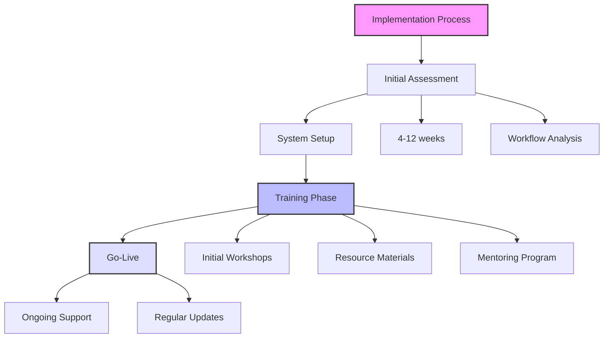
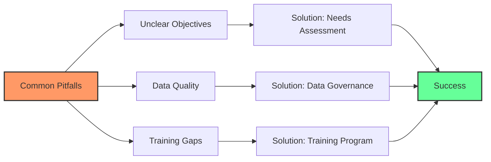
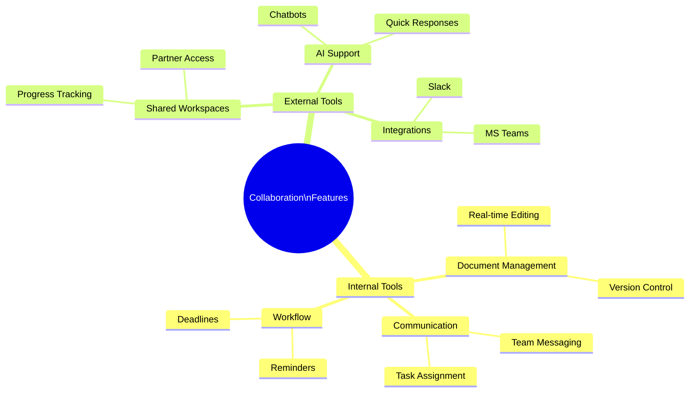
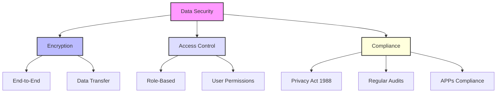

These are likely questions the workshop attendees are likely to have, based on their backgrounds, professional roles and the content covered.

### 1. About AI Capabilities:

**How does the Vi Platform specifically tailor AI functionalities to meet the unique challenges of mission-critical communications?**  

The Vi Platform is built to address the complexities of mission-critical communications by leveraging advanced AI algorithms. These include:
- Real-time analysis to optimise network performance during emergencies.
- Workflow automation to reduce response times in critical situations.
- Centralised collaboration tools to ensure clarity in operations across teams.
- Customisable solutions for compliance and adherence to unique communication protocols required during emergencies.

**What steps have been taken to ensure that Vi’s AI solutions remain compliant with Australian government standards and regulations?**  

ConceptV ensures compliance by:
- Consulting legal and compliance experts to embed adherence to Australian laws, such as the **Privacy Act 1988**, within the Vi Platform.
- Conducting regular audits against Australian Government procurement and communication standards.
- Building AI systems with role-based access controls and secure data storage mechanisms in line with Australian regulatory expectations.

---
### 2. Implementing AI Solutions:

**What is the typical timeframe for implementing AI tools like Vi within our existing systems and workflows?**  

Implementation typically takes **4 to 12 weeks**, depending on:
- The complexity of existing workflows and systems.
- The level of customisation required.
- Team availability for training and onboarding.  
This includes consultation, integration, training, and testing phases.

**Can you share examples of how other similar companies have successfully integrated AI tools into their operations?**  

- **Public Safety Communication Company**: Used AI analytics for emergency response planning, reducing response times by 30%.
- **Construction Firm**: Implemented tender management AI, automating document generation and compliance checks, resulting in a 25% higher bid win rate.

---
### 3. Customisation Options:

**How adaptable is the Vi Platform for our specific operational requirements and pain points?**  
The Vi Platform is highly adaptable:

- It supports integrations with your existing systems.
- Custom workflows and features can be developed specifically to address your operational pain points, like tender inefficiencies or compliance gaps.

**What level of customisation can we expect with the AI solutions being offered? Can we tailor them to address local jurisdictional differences in our tender processes?**  

- Yes, the platform supports extensive customisation.
- It can incorporate specific compliance rules or guidelines unique to different states, ensuring tender processes align with local regulations.
- Custom dashboards, templates, and compliance tools can be built to support Hypha’s requirements.

These detailed answers provide practical insights and showcase how the Vi Platform aligns with both operational challenges and regulatory needs in Hypha’s field.

---
### 4. Cost Considerations:

**What is the pricing structure for the Vi Platform and its functionalities? Are there additional costs we should anticipate for the implementation and ongoing use?**  

The pricing structure for the Vi Platform typically consists of a tiered subscription model based on the features and number of users. Key aspects include:
- **Basic Package**: $2,000–$5,000 per month for essential capabilities and support.
- **Full Suite Package**: $10,000–$25,000 per month for comprehensive functionalities, including advanced tools and priority support.
- **Implementation Costs**: Initial setup costs may range between $10,000 to $30,000, depending on customisation and integration requirements.
- **Ongoing Costs**: Additional fees may be incurred for API calls, over-usage of tokens, or specific functionality add-ons, estimated at around $1,000 monthly based on usage patterns.

**How can we quantify the return on investment (ROI) from adopting AI tools like Vi in our tender processes?**  

ROI can be quantified by analysing factors such as:
- **Time Savings**: Estimate the average time saved in tender preparation and compliance checking, translating that into cost savings by calculating the hourly wages of employees involved.
- **Increased Win Rates**: Measure the uptick in successful tender acquisitions post-implementation and project the resultant revenue from new contracts.
- **Reduction in Errors**: Assess the financial implications of reduced errors in submissions due to automation (e.g., lowered rework costs or compliance fines).  
A comprehensive ROI calculation can use the formula: 

ROI=(Total CostsNet Benefits​)×100

where **Net Benefits** include all savings and additional income derived from using Vi versus the total implementation and operational costs.

---
### 5. Training and Support:

**What training will be provided to our staff on using the Vi Platform? Will there be ongoing support post-implementation?**  

Training will include:
- **Initial Staff Training**: Workshops to introduce all users to the Vi Platform, covering core functionalities and best practices. This will include hands-on activities to ensure effective learning.
- **Webinars and Resource Materials**: Access to recorded sessions, user manuals, and a comprehensive FAQ database for self-paced learning.
- **Ongoing Support**: Post-implementation, ConceptV offers tiered support options, including a dedicated support line and troubleshooting assistance, ensuring users can get help as needed. Regular updates and refresher training sessions will also be provided.

**How will you ensure that the end-users are comfortable and efficient in using the new AI tools?**  

To promote user comfort and efficiency:
- **User Feedback Incorporation**: Conduct regular surveys and feedback sessions to gather user experiences and iteratively improve training resources.
- **Dedicated Training Sessions**: Focused workshops on specific features or use cases to reinforce learning where necessary.
- **Mentoring Programmes**: Pairing experienced users with newer team members to foster peer learning and support. This ensures on-the-job training and quicker acclimatisation to the Vi Platform.

---
### 6. Long-Term Benefits:

**In what ways can AI tools like Vi improve our competitive edge in the tender acquisition process?**  

AI tools can enhance competitive edge through:
- **Efficiency Gains**: Automating the preparation processes reduces turnaround times, allowing Hypha to respond to tenders faster than competitors.
- **Data-Driven Insights**: By leveraging predictive analytics, Hypha can make informed decisions on bids based on historical data, ensuring more strategic submissions.
- **Superior Compliance**: Automating compliance checks ensures that tenders meet regulatory standards, reducing the risk of rejections and enhancing Hypha's reputation as a reliable contractor.

**How do you foresee the role of AI evolving in the mission-critical communications landscape over the next few years?**  

The role of AI in mission-critical communications is expected to grow significantly, focusing on:
- **Enhanced Real-Time Decision-Making**: AI will facilitate more responsive systems for emergency services, allowing for quicker actions based on data analytics.
- **Integration with IoT and Edge Computing**: As more devices connect to networks, AI will play a central role in managing and optimising data flows and communications for increased efficiency.
- **Proactive Maintenance and Management**: AI will shift from reactive to predictive models, foreseeing problems before they occur and ensuring consistent communication quality.

This evolution will position AI as an essential component in maintaining reliable operations within the fast-paced environment of mission-critical communications.

---
### 7. Real-World Examples:

**Can you provide specific case studies or success stories of other companies in similar fields that have adopted AI tools effectively?**  

- **Case Study: Public Safety Communications in Canada**  
  A Canadian telecommunications company integrated AI technology into its emergency services mobile network. The implementation of AI-enabled predictive analytics reduced response times to emergency calls by **25%**. AI processed historical data to optimise resource allocation effectively, ensuring critical response teams were dispatched swiftly during peak usage periods.

- **Case Study: Construction Industry**  
  An Australian construction firm adopted AI-driven project management solutions, automating document generation and compliance checks. The integration increased their bid-win rates by **30%**, allowing them to focus more on strategy and less on manual submission efforts.

**What are some of the most common pitfalls companies face when implementing AI solutions in this industry, and how can we avoid them?**  

- **Common Pitfalls:**
  - **Lack of Clear Objectives:** Companies often rush into AI implementation without clearly defining the business problems they aim to solve.  
  - **Data Quality Issues:** Poor-quality data hampers AI effectiveness; organisations frequently fail to clean and organise their data adequately before implementation.  
  - **Insufficient Training and Change Management:** Employees may resist adopting new AI systems without proper training or clear communication about the benefits.

- **Avoidance Strategies:**
  - Conduct thorough **needs assessments** to align AI initiatives with organisational goals.
  - Implement a **data governance framework** to ensure high-quality data entry, storage, and management practices.
  - Establish comprehensive **training programs** and change management strategies to facilitate smoother transitions to new systems.

---
### 8. Collaborative Applications:

**How can the Vi Platform facilitate better collaboration among our teams during the tendering process?**  

The Vi Platform offers several features to enhance team collaboration:
- **Centralised Document Management:** Teams can upload, share, and collaboratively edit tender documents in real time, ensuring everyone has access to the latest information.
- **AI-Powered Communication Tools:** Built-in messaging functions allow team members to discuss tender strategies and updates instantly within the platform.
- **Task Management Features:** Responsibilities can be assigned to specific team members, with deadlines and reminders automating follow-ups and ensuring accountability.

**Are there any collaborative tools within Vi that enhance communication with our partners or subcontractors?**  

Yes, Vi includes features designed to facilitate external communication:
- **Shared Workspaces:** These allow Hypha and its partners or subcontractors to collaborate directly on project documents, share insights, and manage progress in real time.
- **Integration with External Communication Channels:** Vi can sync with platforms like Slack or Microsoft Teams, enabling seamless external communications while keeping project discussions organised.
- **AI Chatbots:** These can handle common inquiries from partners or subcontractors, providing instant responses and reducing the workload for Hypha’s team.

---
### 9. Data Security and Privacy:

**How does the Vi Platform handle data security, especially concerning sensitive information related to government contracts?**  

The Vi Platform prioritises robust data security through:
- **End-to-End Encryption:** All data transfers within the platform are encrypted, ensuring protection against unauthorised access.
- **Role-Based Access Control (RBAC):** This restricts data access based on user roles, ensuring only authorised personnel can view or edit sensitive contractual information.

**What measures are in place to guarantee compliance with data protection regulations in Australia?**  

- **Compliance Frameworks:** The Vi Platform is designed to conform with **Australian Privacy Principles (APPs)** under the Privacy Act 1988.
- **Regular Audits:** ConceptV conducts regular audits of its systems and processes to ensure continuing compliance with local data protection regulations.
- **Data Governance Policies:** Strong data governance policies dictate how data is handled, stored, and shared, ensuring that compliance is integral to overarching operational practices.

---
### 10. Future Developments:

**Are there plans for future upgrades or enhancements to the Vi Platform based on emerging technologies or customer feedback?**  

Yes, continuous improvements will drive future upgrades, including:
- **Integration of New AI Models:** Keeping pace with advancements in AI technology, such as integrating more robust models that improve language understanding and document analysis.
- **User-Requested Features:** ConceptV consistently solicits feedback to enhance platform functionality tailored to operational needs, ensuring user satisfaction drives development.

**How can we ensure that our use of AI tools stays relevant in a rapidly changing technological landscape?**  

- **Regular Training Sessions:** Providing ongoing training for users to keep them updated on new functionalities and industry changes helps maintain competence.
- **Continuous User Engagement:** Actively seeking user feedback and adapting the platform to evolving needs ensures relevance.
- **Partnerships with Tech Innovators:** Collaborating with cutting-edge AI development companies will integrate the latest advancements and trends into Hypha’s operations.