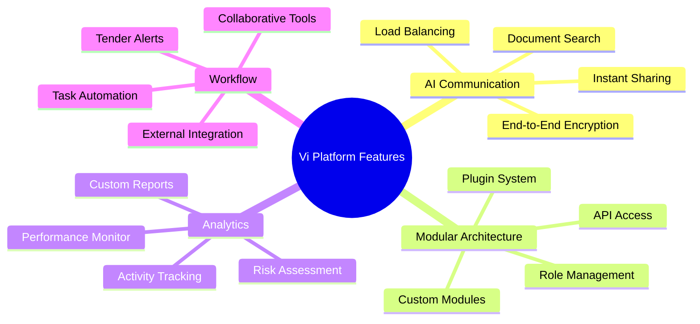

## 1. **AI-Powered Communication Platform**

   - **Features:**
     - **Reliable Messaging System:**
       - **End-to-End Encryption:** Ensures messages are secure and private.
       - **Delivery and Read Receipts:** Indicates whether messages were received and read.
       - **Multi-Device Sync:** Allows users to access messages across different devices.
     - **Scalable Infrastructure:**
       - **Load Balancing:** Distributes user traffic evenly to prevent server overload.
       - **Cloud Storage Integration:** Ensures data is backed up and accessible from anywhere.
     - **Document Search Assistant:** Enables users to search for specific clauses or information across multiple documents using natural language queries.
     - **Instant Document Sharing:** Allows users to share documents directly in conversations, streamlining collaboration on proposals.

   - **Explanation:** This platform addresses communication delays and reliability issues, ensuring essential communications remain uninterrupted and enhancing productivity through easy access to vital information.
   

## 2. **Modular and Customisable Architecture**

   - **Features:**
     - **Plugin Architecture:**
       - **Third-Party Integrations:** Ability to add plugins for tools like CRM systems, marketing platforms, and project management applications.
       - **Custom Module Development:** Enables internal teams to build specific modules tailored to Hypha’s needs.
     - **API Accessibility:**
       - **RESTful APIs:** Facilitates smooth data exchanges with third-party services.
       - **Webhook Support:** Allows real-time updates between platforms.
     - **User Role Management:** Establishes role-based access controls to tailor visibility and access for different users.
     - **Marketplace for Custom Plugins:** A dedicated space to find and implement community-developed plugins, enhancing functionality.

   - **Explanation:** These features highlight the importance of modular architecture, enabling tailored solutions while fostering community collaboration, addressing the integration needs of Hypha.

## 3. **Advanced Analytics Dashboard**

   - **Features:**
     - **Data Tracking Components:**
       - **User Activity Logs:** Captures detailed records of user interactions.
       - **Performance Metrics Dashboard:** Presents KPIs like message volume and task completion rates in visual formats.
     - **Reporting Tools:**
       - **Custom Report Builder:** Users can create tailored reports based on specific metrics.
       - **Automated Scheduling for Reports:** Enables automatic generation and distribution of reports.
     - **Performance Monitoring on Collaborative Tasks:** Shows team contributions on projects, highlighting participation levels.
     - **Risk Assessment Visualisation:** Provides analytics on legal documents indicating potential risks associated with missing clauses.

   - **Explanation:** The dashboard's focus on real-time insights supports strategic decision-making and enhances operational oversight, aligning with the needs for performance tracking and risk management.

## 4. **Automated Workflow Management**

   - **Features:**
     - **Task Automation Functions:**
       - **Template-Based Task Creation:** Users can create templates for recurring tasks.
       - **Conditional Triggers:** Enables actions to start automatically based on specific conditions.
     - **Integration with External Services:**
       - **Email Automation:** Auto-sends follow-up emails based on task statuses.
       - **Centralised Collaboration Spaces:** Allows teams to work together on one platform.
     - **Automated Tender Alerts:** Notifies users about relevant upcoming tenders based on service scope.
     - **Collaborative Editing and Commenting Tools:** Facilitates simultaneous document edits and comments for effective collaboration.

   - **Explanation:** These enhancements cater to immediate workflows, ensure Hypha remains proactive in tender pursuits, and promote efficient teamwork on complex documents.

## Conclusion:

These comprehensive product recommendations integrate specific features to enhance Hypha's operational efficiency, reflecting user experiences from the workshop trials. By addressing pressing needs observed during this phase, Hypha can optimise its workflow and communication strategies effectively. 

