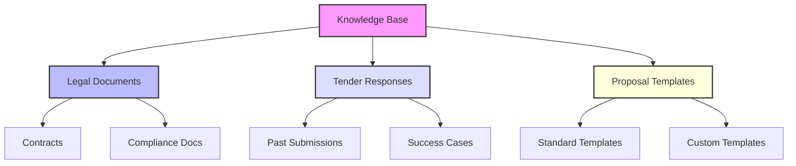
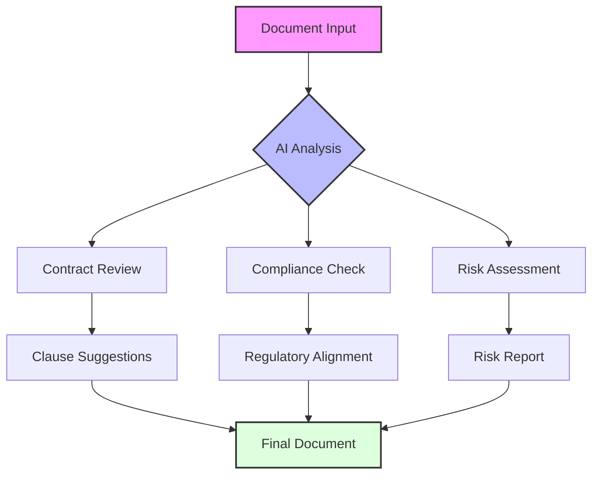

The first product iteration will be hosted in LobeChat's environment, powered by Project Vi and custom functions, developed to meet Hypha's business needs and goals. LobeChat’s modular plugin architecture enables rapid rollout of features, such as chat-integrated task management or document review processes. Existing functionalities can be extended with specific plugins tailored to Hypha’s workflows.

## Key Functionalities:

#### **Plugin Environment**

   - **Plugin Support:** The platform will support the integration of external tools commonly used by Hypha, enabling streamlined workflows and data continuity.
   - **Custom Plugin Development:** Users can quickly integrate specific services relevant to their operations with minimal coding efforts. For instance, support for plugins integrating legal compliance checklists based on the latest regulations.

#### **Assistant Capabilities**

   - **Task Automation:** Beyond routine reminders, assistants will support sophisticated tasks, such as:
     - Assisting in writing comprehensive proposals by providing templates based on project needs and past successful submissions.
     - Inquiries for detailed information within uploaded documents using natural language processing, facilitating easy retrieval of specific data.
     - Identifying potential risks and areas for improvement in contract and tender documentation, aligned with legal requirements.
     - Summarising and providing insights and action points based on uploaded content - such as meeting recordings, PDF files, etc.

   - **Contextual Responses:** Assistants will not only respond to queries but also deliver concise summaries of uploaded documents, covering critical components such as conditions, specifications, key dates, and document structures.

#### **Knowledge Base Integration**

   - **Documentation Uploading:** Users will maintain organised repositories for easy access to critical documents, including contracts, proposals, and tender applications.
   - **Organising Knowledge Bases:** Advanced categorisation through:
     - **Metadata Tagging:** Enabling efficient retrieval against specific legal or regulatory aspects and tender requirements, making it simple to answer inquiries about specific details.
     - **Folder Structure:** Pre-organised Knowledge Bases may include “Legal Documents,” “Tender Responses,” and “Proposal Templates” to streamline document access. During training, include explanations about where users should upload specific files.

#### **Native Functionalities**

   - **Real-Time Communication:** Enhanced with document collaboration tools, which can provide simultaneous editing features for tender documents, agreements, and contracts.
   - **Document Review Capabilities:** Assistants could:
     - Review contracts for Hypha interests, highlighting areas needing adjustments or suggesting relevant clauses to ensure optimal liability protection and risk mitigation.
     - Review and summarise MOUs or other strategic documents, pinpointing risks and interests crucial to Hypha's operational integrity.

#### **Legal and Tendering Support Functions**

   - **Comprehensive Contract Assistance:**
     - Assistants can help review clauses, suggest modifications, and redraft sections to ensure alignment with regulatory frameworks or internal policies.
     - Draft detailed departure tables from contracts with rationales for suggested adjustments to maintain clarity and compliance.

#### **Tender Application Aid:**

 - Automate the process of searching for available tenders through web scraping, providing refined results compatible with Hypha's services.
 - Aid users in filling in and responding to tender applications by referencing previous tenders for comparative analysis.
 - Provide insights and strategies for negotiation and partnership based on the reviewed documents.

#### **Employee Advisory Features:**

 - Assistants could offer tailored advice on handling employee-related situations that may affect production schedules, ensuring a proactive approach to human resource challenges.
 - Enable quick searching for compliance regulations and consulting services related to tender documents, contract reviews, and indemnity protections.

#### **Permissions Management:**

- Integrate robust **role-based access controls (RBAC)** into LobeChat’s workflows to ensure that automation is accessible and actionable only by authorised personnel.

#### **Data-Driven Reporting and Analytics**

- **Dynamic Dashboards Using Artifacts:**
    - Use **Artifacts** to create built-in reporting dashboards within LobeChat, providing real-time analytics on performance metrics like proposal turnaround time and project progress.

- **Integration with Data Visualisation Tools:**
    - Connect with external tools like **Google Data Studio**, **Tableau**, or **Power BI**through LobeChat's APIs for extended data visualisation capabilities.

- **Permissions for Analytics:**
    - Configure RBAC for varying levels of access to reporting dashboards. For instance:
        - **Team Leads:** View and edit team-specific reports.
        - **Execs:** Access organisation-wide metrics.

#### **AI-Powered Strategy Refinements**

- **Continuous Learning Through Vi:**
    - Vi ensures ongoing improvement by analysing workflows, identifying inefficiencies, and recommending optimisations for both automation and manual processes.

- **Future-Proof Development:**
    - LobeChat’s flexible environment combined with Vi's AI capabilities allows Hypha to sustainably scale functionalities, adapting easily to unforeseen future needs.

#### ** Potential Workflow Automation**

- **Workflow Automation Tools:**
    - Leverage **Zapier** or **IFTTT integrations** for triggering automations inside LobeChat workflows, such as sending notifications when specific document types are uploaded, or automating follow-ups for overdue tasks. This is to be further investigated by ConceptV's development team.

- **Custom Plugin Development:**
    - Create lightweight custom plugins tailored for task management features, such as condition-based task routing. Examples:
        - Trigger task assignments when certain conditions (e.g., tender deadlines) are met.
        - Automate delegation to teams based on location or expertise.

## Conclusion:

The revised initial product offering hosted on the LobeChat platform includes a wide range of functionalities that address specific needs highlighted by the test run. This ensures that Hypha’s requirements, particularly concerning legal, operational, and documentation processes, are comprehensively catered to while minimising development efforts for the platform providers.