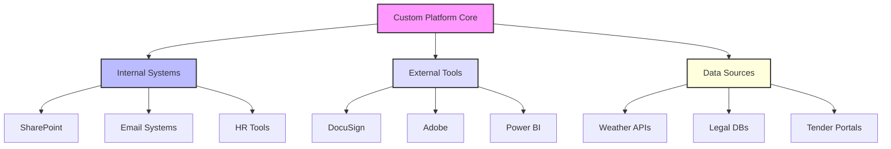
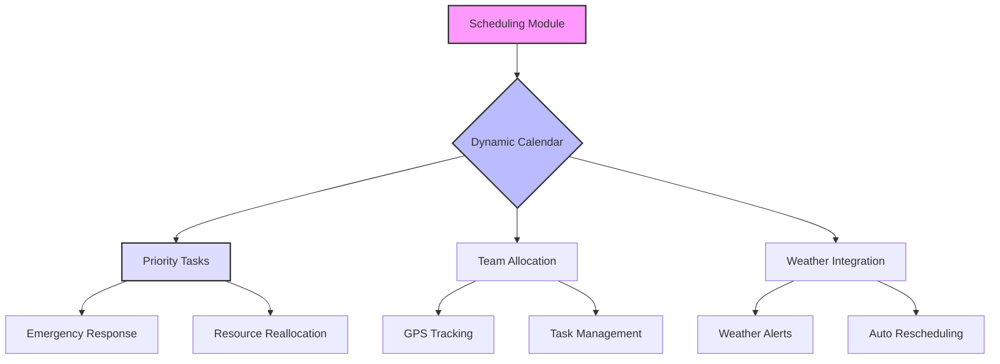
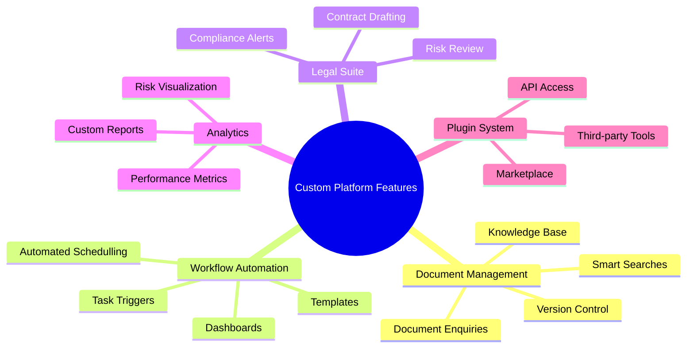

A custom platform for Hypha would transform operational efficiency, decision-making, and collaboration. By integrating with Hypha’s current systems and workflows, the platform will serve as a long-term, scalable solution for meeting and exceeding their business objectives.

### 1. **AI-Oriented Document and Knowledge Management**

   - **Features:**
     - **Smart Document Search and Querying:** Using AI to retrieve specific information (e.g., cost breakdowns, key dates, or clauses) across multi-page documents using natural language queries.
     - **Organised Knowledge Base:** Pre-configured metadata tagging and folder systems (‘Tenders’, ‘Contracts’, ‘Templates’, etc.) for streamlined document retrieval.
     - **Automated Document Summarisation:** Summarises tender requirements, specifications, and risks to save teams valuable time.
     - **Version Control and Collaboration:** Tracks document changes, enabling teams to work collectively.

   - **Value:** 
     Documents are at the core of Hypha’s tender processes. This system would significantly reduce manual searches and ensure easily accessible, relevant data for faster, more informed decision-making.

   - **Integration Options:**
     - Integration with existing document management tools like Microsoft SharePoint, DocuSign, and Adobe Acrobat for editing, signing, and collaborating on PDFs and Word files.
     - Web scraping/webpage parsing tools to ingest documents from tender portals and public repositories.

---

### 2. **Advanced Workflow Automation and Task Management**

   - **Features:**
     - **Task Automation with Conditional Triggers:** Automate repetitive tender processing, follow-ups, and compliance checks.
     - **Template-Based Workflow Creation:** Standardised work templates to guide teams on preparing tender responses or reviews.
     - **Collaboration Dashboards:** Real-time status tracking on pending tasks or approvals for clearer project visibility.

   - **Value:**
     Simplifies process-heavy workflows while dramatically improving efficiency and resource allocation, ensuring quick and accurate execution of recurring operational tasks.

   - **Integration Options:**
     - Sync with tools like Trello or Asana for enhanced task tracking.
     - Integration with Hypha’s internal workflow systems (if applicable) or email services for task commencement alerts.

---

### 3. **Custom Compliance and Legal Review Suite**

   - **Features:**
     - **AI-Driven Contract Review:** Identify risks, inconsistencies, missing clauses (e.g., IP rights, costs, and liability caps), and suggest improvements.
     - **Redrafting Clauses and Customisation Tools:** Automated drafting of legally sound clauses or amendments to contracts.
     - **Regulatory Compliance Alerts:** Tailored notifications when a clause risks non-compliance with regional or international regulations.

   - **Value:**
     Reduces dependence on external legal teams for everyday contractual tasks, saving time and minimising human error, especially during high-stakes tenders.

   - **Integration Options:**
     - Plug-ins for regulatory libraries and legal databases, such as LexisNexis or Thomson Reuters Practical Law.
     - Direct connections to in-house or external legal management tools.

---

### 4. **Data-Driven Advanced Analytics Dashboards**

   - **Features:**
     - **Performance Metrics and Insights:** Track tender response times, success rates, and project performance indicators in visual formats.
     - **Legal Risk Visualisation:** Analytics on legal documents, identifying risk levels associated with each tender or contract.
     - **Customisable Reporting Tools:** Users can create tailored reports for tender analyses or internal presentations.

   - **Value:**
     Drives informed decision-making by providing actionable insights that align operational goals with measurable outcomes.

   - **Integration Options:**
     - Sync with data sources like Salesforce or spreadsheets.
     - Use Power BI or Tableau connectors for extended, customisable data visualisations.

---

### 5. **Plugin Marketplace and Modular Architecture**

   - **Features:**
     - **Expandable with Plugins:** Enable third-party integrations and extensions for tools Hypha often utilises, such as CRM systems or project management software.
     - **API Accessibility:** Open APIs for bi-directional data flow between Hypha’s existing software and the custom platform.

   - **Value:**
     Flexibility to adapt the platform to new technologies or workflows as Hypha scales, without large overhauls.

   - **Integration Options:**
     - Build API links to existing systems, ensuring seamless connectivity for CRMs like HubSpot or Dynamics 365.
     - Webhooks for real-time updates from other services or tender notifications from external portals.

---

### 6. **Custom Tender Management Module**

   - **Features:**
     - **Tender Alerts and Monitoring:** Auto-monitoring tender boards and sending curated tender alerts based on service scope.
     - **Tender Preparation Toolkit:** Preloaded templates, guidance documents, and auto-populated fields leveraging past submissions.
     - **Bid Cost Optimisation:** AI tools recommending cost-effective strategies based on historical data.

   - **Value:**
     Keeps Hypha ahead of the curve in monitoring and responding to tenders, whilst improving efficiency and competitiveness in submissions.

   - **Integration Options:**
     - Integration with public tender platforms using APIs or scraping tools.
     - External financial software (e.g., QuickBooks or Xero) for instant cost tracking on bid estimations.

---

### 7. **User Role Management and Security**

   - **Features:**
     - **Role-Based Access Control (RBAC):** Custom access levels for sensitive areas like contract reviews or financial summaries.
     - **Audit Trails:** Logs and monitors user activities for transparency and compliance.

   - **Value:**
     Tailors user experiences, protects sensitive information, and ensures accountability within teams.

   - **Integration Options:**
     - Unified access with single sign-on tools, such as Okta or Azure AD.
     - Data encryption integrated with security suites.

---

### 8. **Employee Management and Advisory Centre**

   - **Features:**
     - **HR Issue Tracker:** A knowledge hub for resolving employee-related challenges.
     - **AI-Assisted HR Advisory:** Provide guidance on employee situations and schedule conflicts impacting production.

   - **Value:**
     Proactively addresses HR challenges to preserve operational timelines and ensure a balanced workplace environment.

   - **Integration Options:**
     - Integration with payroll systems (ADP, BambooHR) for seamless employee data analysis.
     - Calendar systems (Outlook or Google) for managing schedules and shifts.

---

### Scheduling Coordination Module for Hypha’s Custom Platform

Given Hypha’s need to coordinate work in remote areas and emergency situations efficiently, we recommend the **Scheduling Coordination Module**. This module integrates advanced scheduling, multi-stakeholder coordination tools, task allocation features, and weather forecasting capabilities to optimise on-site operations.

---

### 9. Scheduling Coordination

- **Features:**
1. **Dynamic Calendar and Priority Scheduling**
   - **Integrated Calendar System:** Centralised visibility of all team/project schedules across regions and stakeholders to prevent overlaps.
   - **Conflict Detection:** Highlights scheduling clashes or overbooked resources.
   - **Priority Scheduler for Emergencies:** Automatically reassigns resources and teams to urgent tasks.

   **Value for Hypha:**
   Ensures seamless operations during critical situations like emergency inspections or high-priority maintenance. Conflicts and redundant efforts are significantly minimised.

2. **Multi-Team Collaboration Tools**
   - **Task Allocation Across Teams:** Assign specific tasks (e.g., inspections, maintenance) based on team expertise, location, and availability.
   - **Stakeholder Integration:** Enables real-time coordination with contractors, government bodies, and emergency teams.
   - **Cross-Team Communication Platform:** Integrated chat and project management tools to ensure synchronous communication.

   **Value for Hypha:**
   Facilitates effective collaboration between field teams and decision-makers, particularly under emergency conditions, ensuring accountability and operational clarity.

3. **Weather-Based Scheduling**
   - **Weather Data Integration:** Sync scheduling features with live weather forecast APIs (e.g., OpenWeatherMap) to anticipate disruptions.
   - **Automated Rescheduling:** Detects potential weather issues and reschedules tasks to minimise cancellations.
   - **Weather Alerts for Remote Areas:** Provides teams with real-time updates on weather risks to optimise preparation and safety.

   **Value for Hypha:**
   Reduces disruptions caused by adverse weather conditions, optimising resource allocation while safeguarding on-site operations.

4. **Task Tracking and Reporting**
   - **GPS-Enabled Field Coordination:** Tracks team locations and progress in real-time for better accountability.
   - **Completion Monitoring:** Ensures completed tasks are appropriately recorded and pending tasks are escalated if delayed.
   - **Auto-Generated Progress Reports:** Summarises team activities on a daily/weekly basis for management review.

   **Value for Hypha:**
   Ensures transparency and detailed tracking of tasks in geographically challenging environments, leading to better resource planning and reporting.

5. **Mobile-First Functionality**
   - **Mobile App Access:** Field teams can access assigned tasks, schedules, and updates directly from mobile devices.
   - **Offline Mode for Remote Areas:** Allows users to download task lists and sync updates once internet connectivity is available.

   **Value for Hypha:**
   Enhances accessibility in remote locations, ensuring seamless task execution without dependency on constant connectivity.

- **Integration Options:**
    - **Weather Forecast Systems:** Integration with APIs like OpenWeatherMap, AccuWeather, or IBM Weather Company for live and predictive weather data.
    - **Collaboration Tools:** Sync tasks with Slack, Microsoft Teams, or in-project communication tools available on Hypha's current systems.
    - **Mapping and Geolocation Tools:** Use Google Maps or custom GIS tools for team tracking and site management.
    - **Field Management Applications:** Tools like UpKeep or ServiceMax for integrating maintenance-focused workflows.

---

## **Feature Overview**

