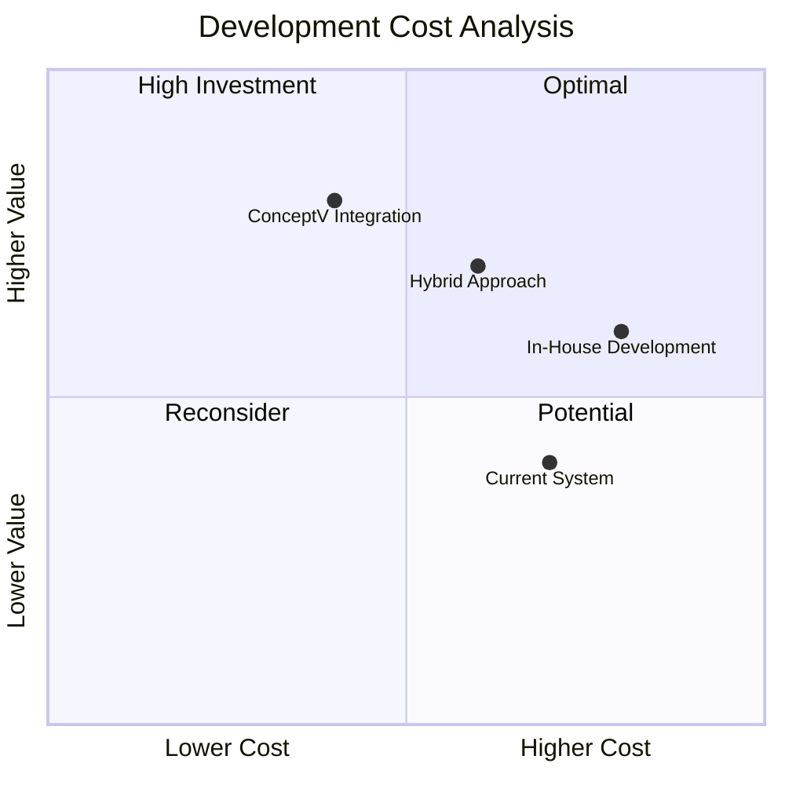

While Hypha currently employs a dedicated team of developers for their custom in-house platform solution, it incurs substantial annual costs primarily related to developer wages. Here is an overview of how integrating ConceptV and AI can streamline these processes:

### 1. **Cost Efficiency and Resource Allocation**:

   - **Reducing Development Costs:** By partnering with ConceptV, Hypha can leverage our existing framework and tools, mitigating the steep costs associated with maintaining a full in-house development team.
   - **Focus on Core Competencies:** With ConceptV handling the technological backbone, Hypha’s internal developers can refocus on higher-value projects that align with strategic initiatives and core competencies, thereby optimising resource allocation.

### 2. **Utilising ConceptV's Proprietary Technology (Vi)**:

   - **AI Contribution:** Our proprietary technology, Vi, can automate many standard features and functionalities, such as document management, compliance checks, and analytics. This reduces the need for custom code and accelerates deployment timelines.
   - **Integration with Existing Systems:** Vi can seamlessly integrate with any applications developed by Hypha to date, ensuring no prior investments in development are lost. This preserves previous efforts while supplementing them with state-of-the-art enhancements.

### 3. **Streamlined Development Process**

   - **Agile Development Methodology:** ConceptV applies agile methodologies, enabling iterative development that can adapt quickly to changes in requirements or strategies. This flexibility ensures rapid delivery of functionalities without the extensive time typically associated with custom-built functionalities.
   - **Modular Architecture:** By employing a modular approach, features can be added or modified independently. This approach allows Hypha to scale the platform according to business needs without causing disruptions or requiring rework.

### 4. **Enhanced Collaboration and Communication**:

   - **Real-Time Collaboration:** Through AI-driven collaboration tools, Hypha can achieve better communication among its teams during development phases. This ensures alignment and faster turnaround on decisions and implementations.
   - **Seamless Feedback Integration:** ConceptV’s platform integrates built-in feedback loops, so Hypha can continuously evaluate user experiences and tweak functionality based on real-world interactions.

### 5. **Future-Proofing and Competitive Advantage**:

   - **Technology Leadership:** By integrating Vi’s AI-powered capabilities, Hypha solidifies its position as a tech-forward organisation. This future-proofs their processes against competitors and changing technological environments.
   - **Data-Driven Refinement:** Vi’s analytics features enable continuous refinement of workflows by observing patterns and system performance. This ensures the platform evolves alongside Hypha’s needs.

### 6. **Training and Support Transition**:

   - **Upskilling Current Developers:** ConceptV can train Hypha’s developers to use the new platform and AI-driven tools effectively, empowering them to contribute efficiently and reduce reliance on costly external resources.
   - **Dedicated Support System:** ConceptV will offer ongoing technical support post-transition, ensuring minimal disruption and a confident shift to the new strategy.

### Conclusion:

Transitioning to a custom platform with ConceptV and AI technologies offers Hypha an optimised process that reduces costs, accelerates deployments, and integrates cutting-edge functionalities. By complementing Hypha's prior development efforts with our proprietary technology, this strategy enables more efficient development, streamlined workflows, and a versatile platform equipped for future growth. ConceptV’s solution ensures long-term sustainability and strengthens Hypha's position in its industry while cutting down avoidable developer-related overhead.
