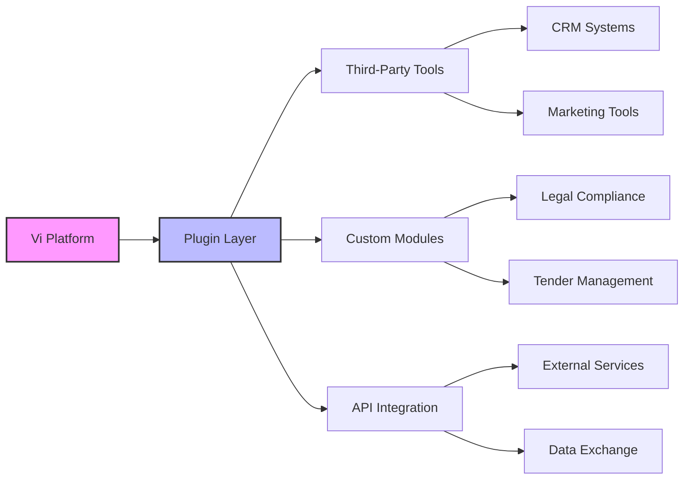
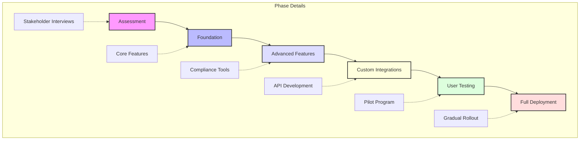
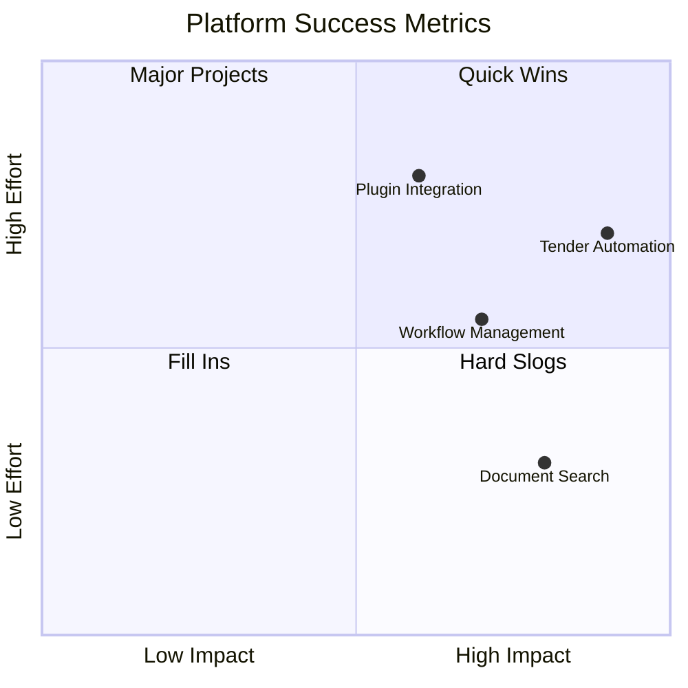

> [!info] Streamlining Operations for Hypha
> 
> **ConceptV**
> February 2025

> [!abstract] Overview
> - Present Hypha's operational challenges and the goals of the initial product release based on findings from the workshop
> - Emphasise the opportunity to enhance efficiencies in proposal writing, document review, and communication

## Product Recommendations

> [!tip] AI-Powered Communication Platform
> - Reliable Messaging System (End-to-End Encryption, Delivery and Read Receipts)
> - Scalable Infrastructure (Load Balancing, Cloud Storage Integration)
> - **Additional:** Document Search Assistant, Instant Document Sharing

> [!tip] Modular and Customisable Architecture
> - Plugin Architecture (Third-Party Integrations, Custom Module Development)
> - API Accessibility (RESTful APIs, Webhook Support)
> - **Additional:** User Role Management, Marketplace for Custom Plugins

> [!tip] Advanced Analytics Dashboard
> - Data Tracking Components (User Activity Logs, Performance Metrics)
> - Reporting Tools (Custom Report Builder, Automated Scheduling)
> - **Additional:** Performance Monitoring on Collaborative Tasks, Risk Assessment Visualisation

> [!tip] Automated Workflow Management
> - Task Automation Functions (Template-Based Task Creation, Conditional Triggers)
> - Integration with External Services (Email Automation, Centralised Collaboration Spaces)
> - **Additional:** Automated Tender Alerts, Collaborative Editing Tools

## Transition Plan to Custom Platform

> [!note] Phase Details
> 
> 1. **Assessment and Requirement Gathering**
>     - Stakeholder interviews and service evaluations
> 2. **Foundation Development**
>     - Core feature establishment (Knowledge Base, User Role Management)
> 3. **Advanced Features and Enhancements**
>     - Integration of compliance tools and cost optimisation
> 4. **Custom Integrations**
>     - API development and plugin ecosystem creation
> 5. **User Testing and Feedback Loops**
>     - Pilot program and iterative feedback incorporation
> 6. **Full Deployment and Support**
>     - Gradual rollout and ongoing maintenance

## Testing and Success Metrics

> [!example] Key Testing Components
> 
> - **Objectives and KPIs**
>     - Document collaboration efficiency
>     - Proposal success rates
>     - Communication enhancements
> - **Pilot Program**
>     - Test product with select group
>     - Collect feedback
>     - Refine features
> - **Feedback Mechanism**
>     - Surveys and focus groups
>     - Post-testing insights gathering
> - **Success Metrics Reporting**
>     - Detailed results summaries
>     - Improvement tracking

## Training and Support

> [!question] Support Framework
> 
> - **Training Sessions**
>     - Guided workshops
>     - Comprehensive documentation
> - **Resource Hub**
>     - FAQs
>     - Troubleshooting tips
>     - Instructional guides

## Long-Term Vision

> [!success] Vision and Benefits **Custom Platform Transition**
> 
> - Seamless integration with refined capabilities
> - Enhanced workflow optimisation
> 
> **Proposed Benefits:**
> 
> - Increased efficiency
> - Improved tender response rates
> - Enhanced collaboration

## Contact Information

> [!info] Tim Geldard
> 
> **Email:** [t.geldard@conceptv.com.au](mailto:t.geldard@conceptv.com.au) 
> **Phone:** 0421 849 615
