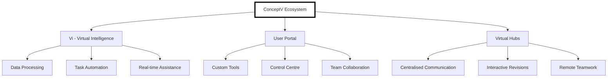

```mermaid
graph TD
    ConceptV[ConceptV Ecosystem] --> Vi[Vi - Virtual Intelligence]
    ConceptV --> Portal[User Portal]
    ConceptV --> Hubs[Virtual Hubs]

    Vi --> Process[Data Processing]
    Vi --> Auto[Task Automation]
    Vi --> Assist[Real-time Assistance]

    Portal --> Custom[Custom Tools]
    Portal --> Decision[Control Centre]
    Portal --> Collab[Team Collaboration]

    Hubs --> Comms[Centralised Communication]
    Hubs --> Review[Interactive Revisions]
    Hubs --> Remote[Remote Teamwork]

    style ConceptV fill:#fff,stroke:#000,stroke-width:4px
```
