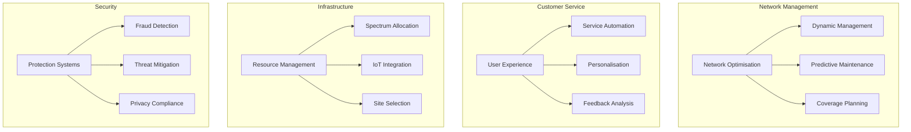

- **Efficiency Gains**: Streamlining processes, reducing time and operational costs. 
- **Workflow Automation**: Alleviating bottlenecks by automating repetitive tasks. 
- **Enhanced Communication**: Improving clarity with AI-driven tools that foster collaboration.
- **Data Insights**: Delivering predictive analytics for better decision-making.

