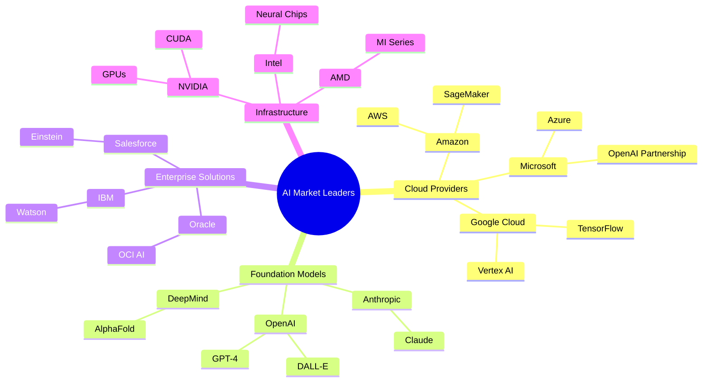

| Category                  | Major Players | Key Products/Services  | Market Focus          |
| ------------------------- | ------------- | ---------------------- | --------------------- |
| Cloud AI                  | Microsoft     | Azure AI, GPT-4        | Enterprise Solutions  |
|                           | Google        | Vertex AI, PaLM        | Search & Analytics    |
|                           | Amazon        | AWS Bedrock, SageMaker | Infrastructure        |
|                           |               |                        |                       |
| Language Models           | OpenAI        | ChatGPT, DALL-E        | General Purpose AI    |
|                           | Anthropic     | Claude                 | Safety-focused AI     |
|                           | Cohere        | Command, Generate      | Business Text AI      |
|                           |               |                        |                       |
| Industry Solutions        | IBM           | Watson                 | Business Intelligence |
|                           | Salesforce    | Einstein               | CRM & Sales           |
|                           | Oracle        | OCI AI                 | Database & Enterprise |
|                           |               |                        |                       |
| Hardware & Infrastructure | NVIDIA        | GPU, CUDA              | AI Computing          |
|                           | Intel         | Neural Chips           | Processing Units      |
|                           | AMD           | MI Series              | AI Acceleration       |