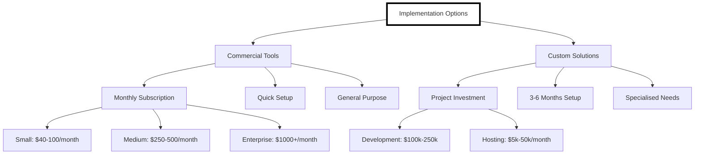

```mermaid
graph TD
    Options[Implementation Options] --> Commercial[Commercial Tools]
    Options --> Custom[Custom Solutions]

    Commercial --> CommercialCost[Monthly Subscription]
    Commercial --> CommercialTime[Quick Setup]
    Commercial --> CommercialUse[General Purpose]

    Custom --> CustomCost[Project Investment]
    Custom --> CustomTime[3-6 Months Setup]
    Custom --> CustomUse[Specialised Needs]

    CommercialCost --> Small[Small: $40-100/month]
    CommercialCost --> Medium[Medium: $250-500/month]
    CommercialCost --> Large[Enterprise: $1000+/month]

    CustomCost --> Dev[Development: $100k-250k]
    CustomCost --> Host[Hosting: $5k-50k/month]

    style Options fill:#fff,stroke:#000,stroke-width:4px
```
