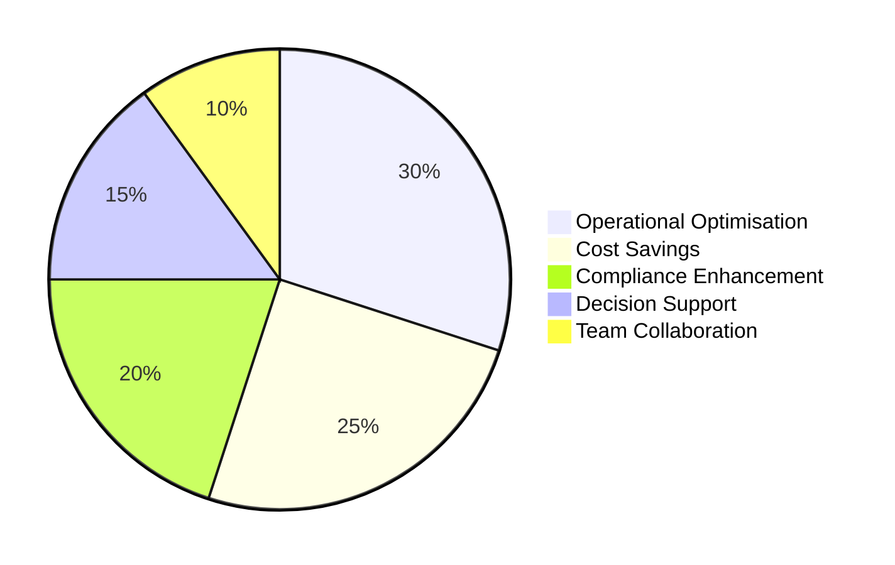
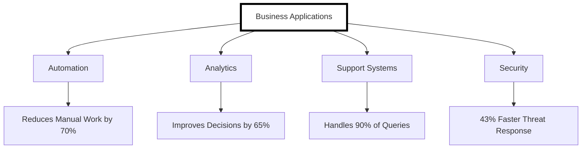

Sources:
[McKinsey Global Institute, 2023]
[Gartner Report, 2023]
[Deloitte AI Report 2023]
[Deloitte AI in Supply Chain Management Report]
[McKinsey Marketing AI Insights]
[PwC Future of Work Report]
[BM Cost of a Data Breach Report 2023]