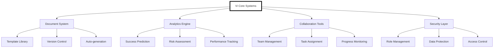

- Automation for repetitive tasks.
- Bridging technical and operational gaps.
- Predictive technologies for informed decision-making.
- Enhanced reliability during operations.
- Creation of feedback loops for continuous improvement.

