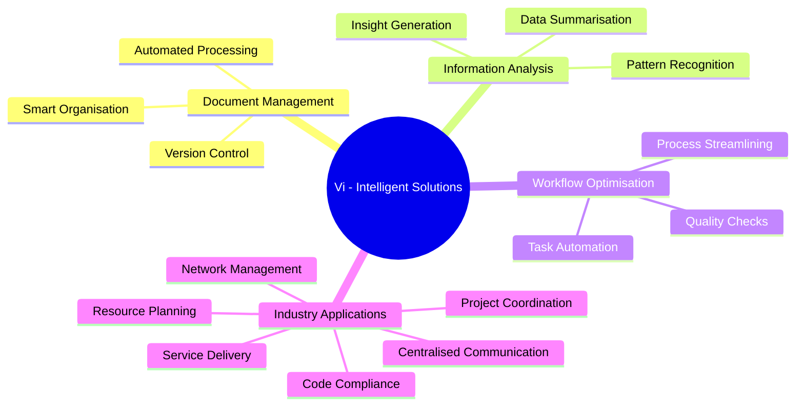
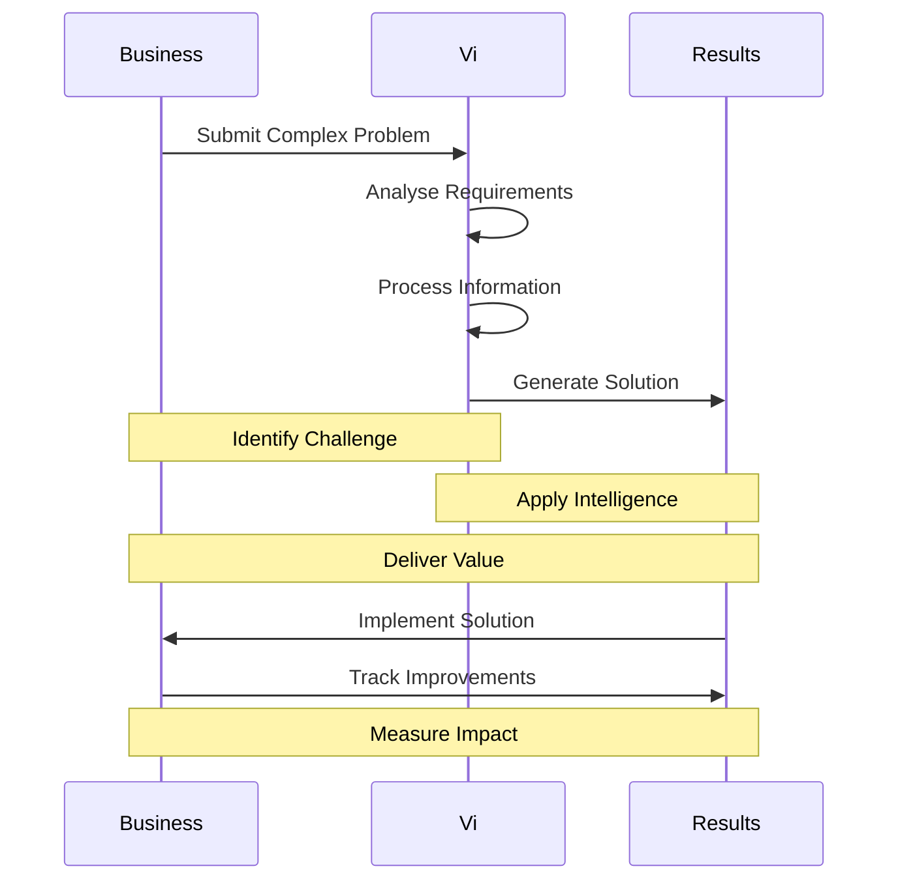

```mermaid
mindmap
    root((Vi - Intelligent Solutions))
        Document Management
            Automated Processing
            Smart Organisation
            Version Control
        Information Analysis
            Pattern Recognition
            Data Summarisation
            Insight Generation
        Workflow Optimisation
            Task Automation
            Process Streamlining
            Quality Checks
        Industry Applications
            Centralised Communication
            Project Coordination
            Resource Planning
            Code Compliance
            Network Management
            Service Delivery
```

```mermaid
sequenceDiagram
    participant Business
    participant Vi
    participant Results
    
    Business->>Vi: Submit Complex Problem
    Vi->>Vi: Analyse Requirements
    Vi->>Vi: Process Information
    Vi->>Results: Generate Solution
    
    Note over Business,Vi: Identify Challenge
    Note over Vi,Results: Apply Intelligence
    Note over Results,Business: Deliver Value
    
    Results->>Business: Implement Solution
    Business->>Results: Track Improvements
    
    Note over Business,Results: Measure Impact
```
