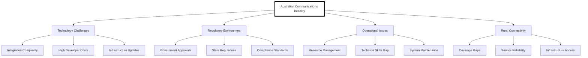

- Operational demands of mission-critical systems.
- The complex landscape of public safety networks.
- Need for advanced analysis and adaptability.
- Need for more efficient tender application processes.