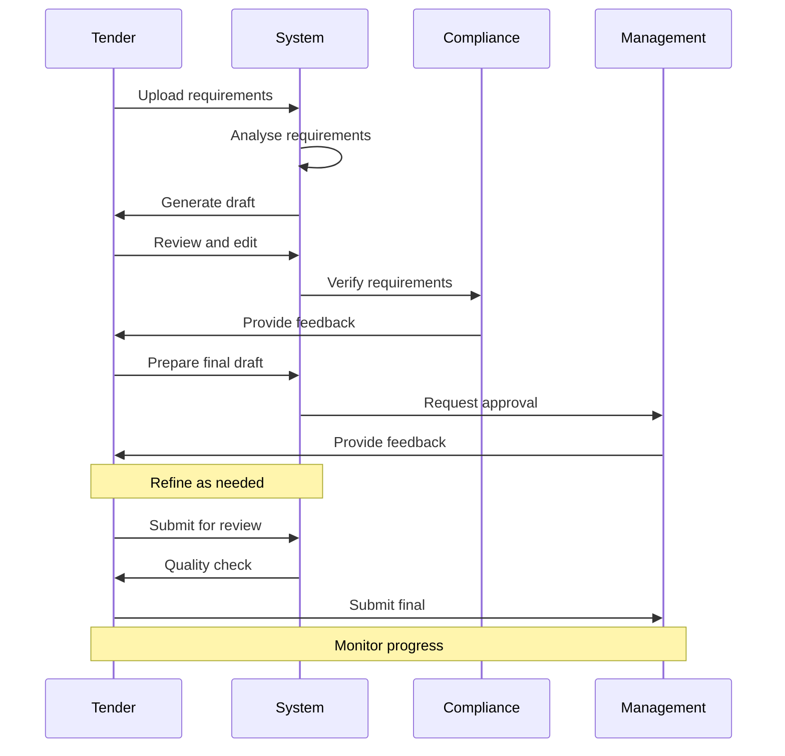
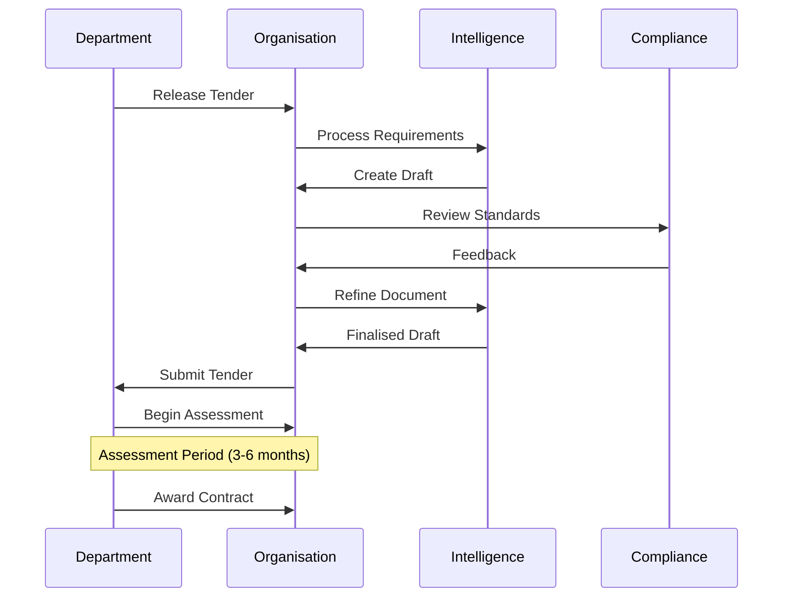

```mermaid
sequenceDiagram
   participant Tender
   participant System
   participant Compliance
   participant Management
   
   Tender->>System: Upload requirements
   System->>System: Analyse requirements
   System->>Tender: Generate draft
   
   Tender->>System: Review and edit
   System->>Compliance: Verify requirements
   Compliance->>Tender: Provide feedback
   
   Tender->>System: Prepare final draft
   System->>Management: Request approval
   Management->>Tender: Provide feedback
   
   Note over Tender,System: Refine as needed
   
   Tender->>System: Submit for review
   System->>Tender: Quality check
   Tender->>Management: Submit final
   
   Note over Tender,Management: Monitor progress
```

```mermaid
sequenceDiagram
   participant Department
   participant Organisation
   participant Intelligence
   participant Compliance
   
   Department->>Organisation: Release Tender
   Organisation->>Intelligence: Process Requirements
   Intelligence->>Organisation: Create Draft
   Organisation->>Compliance: Review Standards
   Compliance->>Organisation: Feedback
   Organisation->>Intelligence: Refine Document
   Intelligence->>Organisation: Finalised Draft
   Organisation->>Department: Submit Tender
   Department->>Organisation: Begin Assessment
   Note over Department,Organisation: Assessment Period (3-6 months)
   Department->>Organisation: Award Contract
```
