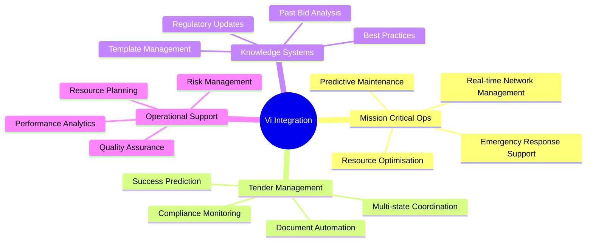

- Bridging the gap in government compliance needs.
- Tender process automation.
- Improving accuracy and compliance in submissions.
- Centralising document management.
- Improved operational efficiency = Time and cost savings.

## Aligning with Hypha's Vision

- Customised solutions for industry-specific applications.
- Driving innovation in mission-critical communication.
