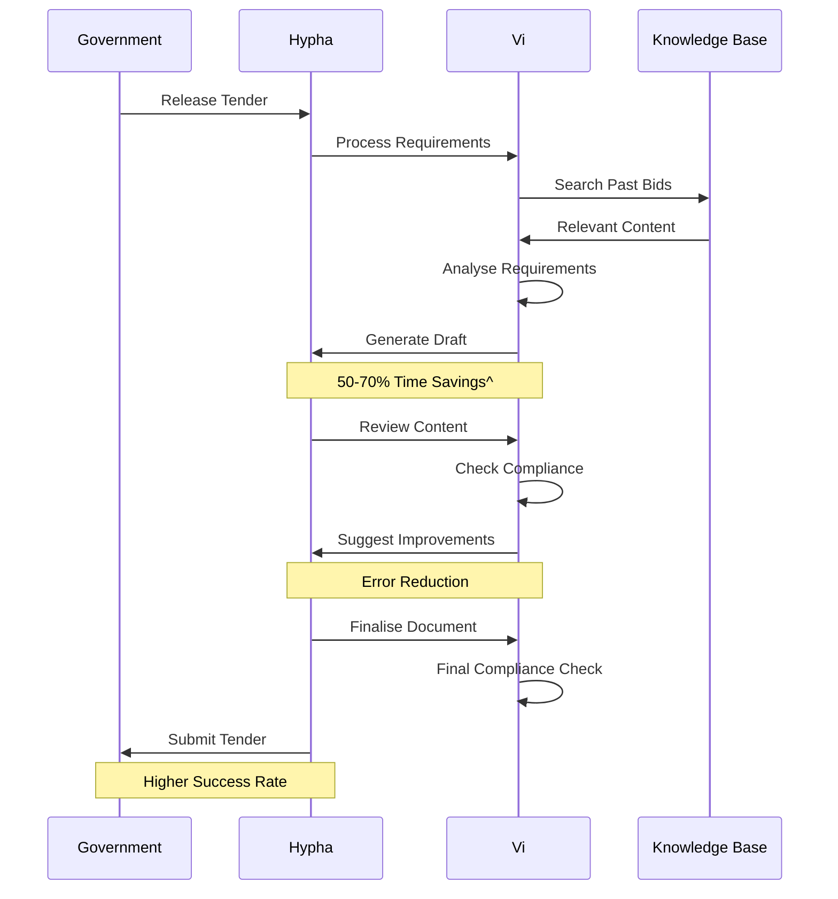

- Streamline bid preparation.
- Review systems for regulatory adherence.
- Predictive analytics for tender success rates.
- Insights into past submissions.
- Prospecting and optimisation of opportunities.

^Based on available information and industry data

