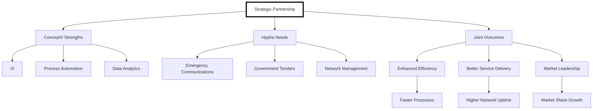

```mermaid
graph TD
    Partnership[Strategic Partnership] --> ConceptV[ConceptV Strengths]
    Partnership --> Hypha[Hypha Needs]
    Partnership --> Outcomes[Joint Outcomes]

    ConceptV --> C1[Vi]
    ConceptV --> C2[Process Automation]
    ConceptV --> C3[Data Analytics]

    Hypha --> H1[Emergency Communications]
    Hypha --> H2[Government Tenders]
    Hypha --> H3[Network Management]

    Outcomes --> O1[Enhanced Efficiency]
    Outcomes --> O2[Better Service Delivery]
    Outcomes --> O3[Market Leadership]

    O1 --> Impact1[Faster Processes]
    O2 --> Impact2[Higher Network Uptime]
    O3 --> Impact3[Market Share Growth]

    style Partnership fill:#fff,stroke:#000,stroke-width:4px
```
