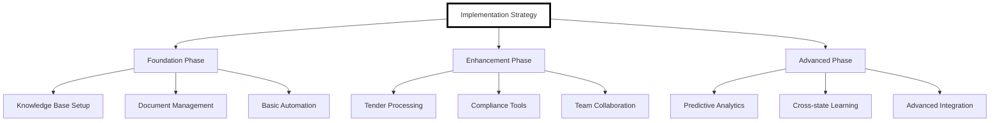
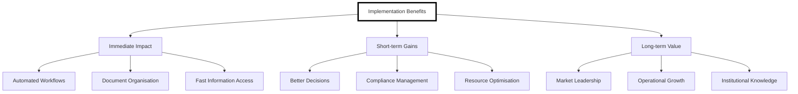

## Steps to Deployment

- Understanding key requirements.
- Integration with Hypha’s established systems.
- Progressive rollout and staff training.

```mermaid
graph TB
    Start[Implementation Strategy] --> Phase1[Foundation Phase]
    Start --> Phase2[Enhancement Phase]
    Start --> Phase3[Advanced Phase]

    Phase1 --> F1[Knowledge Base Setup]
    Phase1 --> F2[Document Management]
    Phase1 --> F3[Basic Automation]

    Phase2 --> E1[Tender Processing]
    Phase2 --> E2[Compliance Tools]
    Phase2 --> E3[Team Collaboration]

    Phase3 --> A1[Predictive Analytics]
    Phase3 --> A2[Cross-state Learning]
    Phase3 --> A3[Advanced Integration]

    style Start fill:#fff,stroke:#000,stroke-width:4px
```

```mermaid
graph TD
    Benefits[Implementation Benefits] --> Immediate[Immediate Impact]
    Benefits --> ShortTerm[Short-term Gains]
    Benefits --> LongTerm[Long-term Value]
    
    Immediate --> Workflows[Automated Workflows]
    Immediate --> Documents[Document Organisation]
    Immediate --> Access[Fast Information Access]
    
    ShortTerm --> Decisions[Better Decisions]
    ShortTerm --> Compliance[Compliance Management]
    ShortTerm --> Resources[Resource Optimisation]
    
    LongTerm --> Leadership[Market Leadership]
    LongTerm --> Growth[Operational Growth]
    LongTerm --> Knowledge[Institutional Knowledge]
    
    style Benefits fill:#fff,stroke:#000,stroke-width:4px
```
