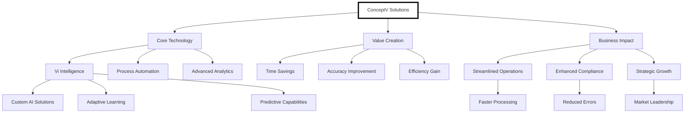
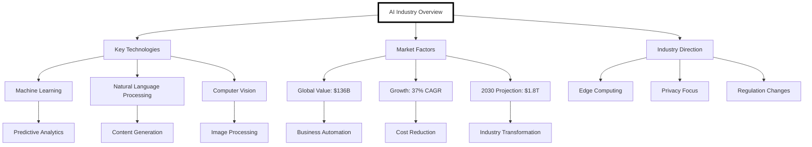
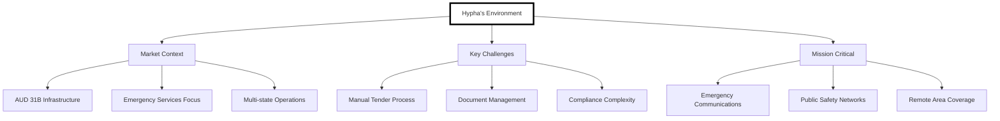
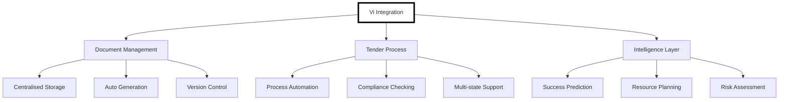

Here's a summary of what we covered:

## ConceptV

```mermaid
graph TD
    ConceptV[ConceptV Solutions] --> Tech[Core Technology]
    ConceptV --> Value[Value Creation]
    ConceptV --> Impact[Business Impact]

    Tech --> Vi[Vi Intelligence]
    Tech --> Auto[Process Automation]
    Tech --> Anal[Advanced Analytics]

    Vi --> V1[Custom AI Solutions]
    Vi --> V2[Adaptive Learning]
    Vi --> V3[Predictive Capabilities]

    Value --> Val1[Time Savings]
    Value --> Val2[Accuracy Improvement]
    Value --> Val3[Efficiency Gain]

    Impact --> I1[Streamlined Operations]
    Impact --> I2[Enhanced Compliance]
    Impact --> I3[Strategic Growth]

    I1 --> Res1[Faster Processing]
    I2 --> Res2[Reduced Errors]
    I3 --> Res3[Market Leadership]

    style ConceptV fill:#fff,stroke:#000,stroke-width:4px
```

## AI Technologies

```mermaid
graph TD
    AI[AI Industry Overview] --> Tech[Key Technologies]
    AI --> Market[Market Factors]
    AI --> Future[Industry Direction]

    Tech --> T1[Machine Learning]
    Tech --> T2[Natural Language Processing]
    Tech --> T3[Computer Vision]

    Market --> M1[Global Value: $136B]
    Market --> M2[Growth: 37% CAGR]
    Market --> M3[2030 Projection: $1.8T]

    Future --> F1[Edge Computing]
    Future --> F2[Privacy Focus]
    Future --> F3[Regulation Changes]

    T1 --> Use1[Predictive Analytics]
    T2 --> Use2[Content Generation]
    T3 --> Use3[Image Processing]

    M1 --> Imp1[Business Automation]
    M2 --> Imp2[Cost Reduction]
    M3 --> Imp3[Industry Transformation]

    style AI fill:#fff,stroke:#000,stroke-width:4px
```

## Hypha

```mermaid
graph TD
    Hypha[Hypha's Environment] --> Market[Market Context]
    Hypha --> Pain[Key Challenges]
    Hypha --> Mission[Mission Critical]

    Market --> M1[AUD 31B Infrastructure]
    Market --> M2[Emergency Services Focus]
    Market --> M3[Multi-state Operations]

    Pain --> P1[Manual Tender Process]
    Pain --> P2[Document Management]
    Pain --> P3[Compliance Complexity]

    Mission --> MC1[Emergency Communications]
    Mission --> MC2[Public Safety Networks]
    Mission --> MC3[Remote Area Coverage]

    style Hypha fill:#fff,stroke:#000,stroke-width:4px
```

## Vi Integration

```mermaid
graph TD
    Vi[Vi Integration] --> Doc[Document Management]
    Vi --> Tender[Tender Process]
    Vi --> Analytics[Intelligence Layer]

    Doc --> D1[Centralised Storage]
    Doc --> D2[Auto Generation]
    Doc --> D3[Version Control]

    Tender --> T1[Process Automation]
    Tender --> T2[Compliance Checking]
    Tender --> T3[Multi-state Support]

    Analytics --> A1[Success Prediction]
    Analytics --> A2[Resource Planning]
    Analytics --> A3[Risk Assessment]

    style Vi fill:#fff,stroke:#000,stroke-width:4px
```

