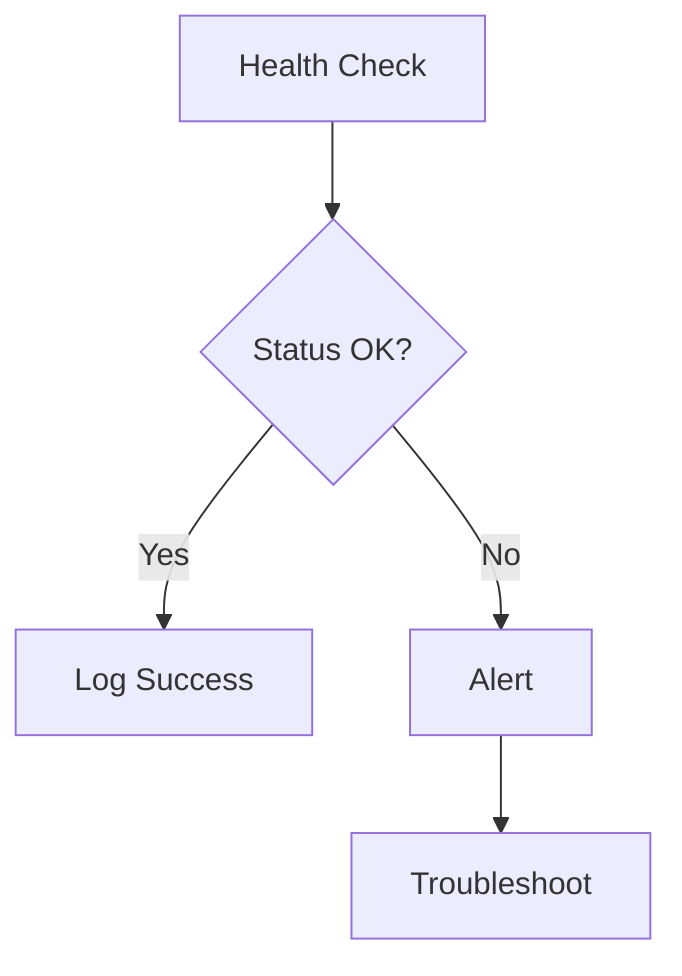

# {{title}} Operations Guide

## Operational Overview
> [!tip] Quick Reference
> - Status Check: `command`
> - Logs: `path/to/logs`
> - Config: `path/to/config`
> - Restart: `command`

## Monitoring
### Health Checks


### Key Metrics
| Metric | Normal Range | Warning | Critical |
|--------|--------------|---------|-----------|
| Metric1 | Range | Threshold | Threshold |

### Log Management
#### Log Locations
- Operation Logs: `path`
- Error Logs: `path`
- Debug Logs: `path`

#### Log Patterns
> [!example] Common Log Patterns
> ```log
> [INFO] Normal operation
> [WARN] Warning condition
> [ERROR] Error condition
> ```

## Maintenance Procedures
### Routine Maintenance
#### Daily Tasks
- [ ] Task 1
- [ ] Task 2

#### Weekly Tasks
- [ ] Task 1
- [ ] Task 2

#### Monthly Tasks
- [ ] Task 1
- [ ] Task 2

### Backup Procedures
```bash
# Backup commands and procedures
```

### Update Procedures
```bash
# Update commands and procedures
```

## Troubleshooting
### Common Issues
| Issue | Symptoms | Resolution |
|-------|----------|------------|
| Issue1 | Symptoms | Steps |

### Diagnostic Tools
- Tool 1: Purpose
- Tool 2: Purpose

### Recovery Procedures
#### Quick Recovery
```bash
# Quick recovery steps
```

#### Full Recovery
```bash
# Full recovery procedure
```

## Performance Optimization
### Resource Management
- Memory optimization
- CPU utilization
- Storage management

### Scaling Guidelines
- Vertical scaling
- Horizontal scaling
- Load balancing

## Emergency Procedures
### Quick Reference
> [!warning] Emergency Contacts
> - Primary: Contact
> - Secondary: Contact
> - Escalation: Contact

### Emergency Shutdown
```bash
# Emergency shutdown procedure
```

### Data Recovery
- Backup restoration
- Data verification
- Service restoration

## Automation
### Monitoring Scripts
```python
# Example monitoring script
```

### Maintenance Scripts
```python
# Example maintenance script
```

## Documentation
### Change Log
| Date | Change | Impact |
|------|--------|---------|
| Date | Change | Impact |

### Incident Reports
- Template
- Storage location
- Review process

---
**Navigation**:
- Back: [[{{title}}-Implementation]]
- Next: [[{{title}}-Integration]]
- Operations Index: [[Operations Dashboard]]